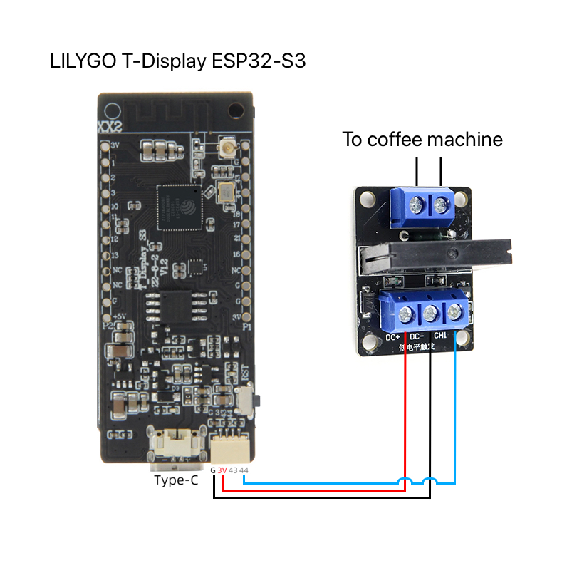

# Satoffee⚡️ (Satoshi + Coffee)

## Project guide

- [🇬🇧 English](https://danielpcostas.dev/satoffee-lightning-coffee/)
- [🇪🇸 Spanish](https://danielpcostas.dev/satoffee-lightning-coffee/)

## Requirements

- Bosch Tassimo 1202 coffee maker
- [LILYGO T-Display-S3](https://www.lilygo.cc/products/t-display-s3)
- 5V Solid State Relay / 1 Way Low
- JST-SH 1.0MM connectors, 4P, 100MM

## Relay connection

The LILYGO T-Display-S3 has a JST-SH connector as shown on the image below. Place the connector and wire the relay.

Remember that you can modify this setup and use your own pins by connecting `+3V`, `GND` and a `GPIO` to the relay.

## Flash firmware

### Web installer (recommended)

Go to the [web installer](https://satoffee.danielpcostas.dev/) and follow instructions. This is the easiest way to flash firmware and load config.

#### Web installer troubleshooting

- It works with chrome, chromium, brave.
- Build errors > If during firmware flash upload stops, it's recommended to enter the board in boot mode. [Follow troubleshoot steps here](https://satoffee.danielpcostas.dev#troubleshoot).

### Manual flashing

- Install [Arduino IDE](https://www.arduino.cc/en/software)
- Install ESP32 boards, using [boards manager](https://github.com/espressif/arduino-esp32/releases/download/2.0.9/esp32-2.0.9.zip)
- Download this repo
- Download and install the libraries into your Arduino install "libraries" folder (see table below)
- Open [satoffee.ino](./satoffee/satoffee.ino) file in the Arduino IDE
- Select the correct ESP32 board from tools > board. Please refer to [T-Display-S3](https://github.com/Xinyuan-LilyGO/T-Display-S3) to set the correct settings of the ESP32. The only difference is on `Partition Scheme`, please select `16M Flash (3MB APP/9.9MB FATFS)`
- Compile and upload to device

| Used library     | Version | Link  |
|:-----------------|:--------|:------|
| WiFi             | 2.0.0   | Included in ESP32 boards manager |
| WiFiClientSecure | 2.0.0   | Included in ESP32 boards manager |
| FS               | 2.0.0   | Included in ESP32 boards manager |
| FFat             | 2.0.0   | Included in ESP32 boards manager |
| SPI              | 2.0.0   | Included in ESP32 boards manager |
| SPIFFS           | 2.0.0   | Included in ESP32 boards manager |
| WebSockets       | 2.3.6   | [link](https://github.com/Links2004/arduinoWebSockets/tree/2.3.6) |
| OneButton        | 2.0.4   | [link](https://github.com/mathertel/OneButton/tree/2.0.4) |
| ArduinoJson      | 6.19.0  | [link](https://github.com/bblanchon/ArduinoJson/tree/v6.19.0) |
| QRCode           | 0.0.1   | [link](https://github.com/ricmoo/QRCode/tree/v0.0.1) |
| TFT_eSPI         | 2.5.0   | [link](./libraries/TFT_eSPI.zip) |

## Configuration

After flashing the firmware and starting the Satoffee for the first time it will enter on `serial config mode` automatically, please go to the [web installer](https://satoffee.danielpcostas.dev/) and follow step 2 for loading config values

### Buttons

#### Left button

- One click → test screen mode (will loop all screens, keep clicking).
- Hold 5 seconds → enter serial config mode.

#### Right button

- One click → show help (will loop help screens)

## Aknowledgement

This project use bits from [bitcoinswitch](https://github.com/lnbits/bitcoinswitch) from Ben Arc.

## Donations/contributions

If you would like to contribute and help dev team with this project you can send a donation to the following LN address:

⚡<danielpcostas@getalby.com>⚡
